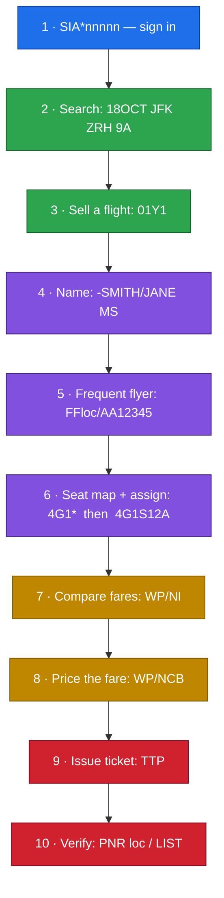
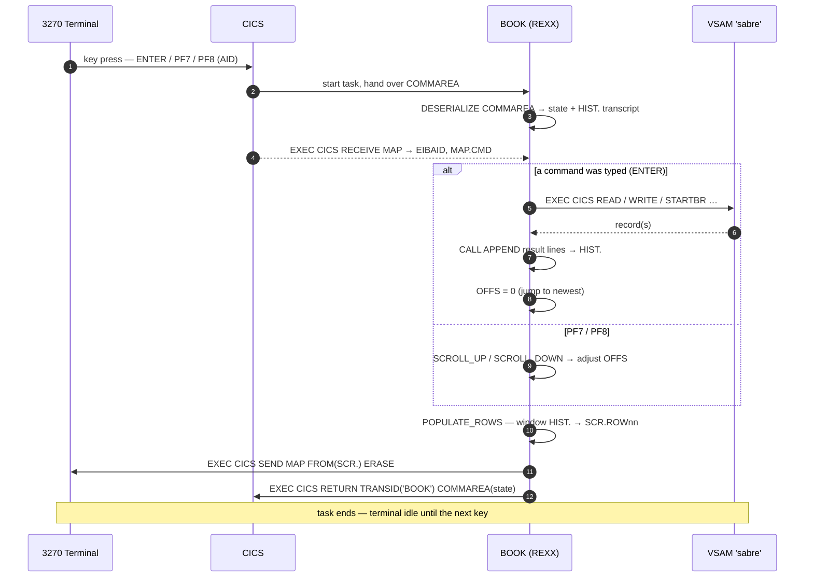
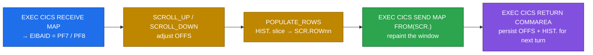

# ✈️ SABRE — the `BOOK` Transaction


`SABR` is a **SABRE airline Computer Reservation System (CRS)** running as a
pseudo‑conversational CICS/3270 transaction on **BRICKS TS**. You drive it the way an
experienced travel agent does: by typing **cryptic command entries** at the `==>` prompt
and pressing <kbd>ENTER</kbd>. It has ~400 real airports, ~150 airlines, live
availability, seat maps, PNRs, pricing, queues and e‑ticketing.

> [!TIP]
> Type **`HELP`** at any time for the in‑terminal command list. Forgot a code?
> `W/*JFK` decodes an airport, `W/*AA` decodes an airline, `W/-CCLONDON` encodes a
> city, and `W/EQ*B789` decodes an aircraft type.

---

## 🎬 Getting started

| Action | Entry | Notes |
| --- | --- | --- |
| 🔐 **Sign in** | `SIA*52BOSS` | Any agent id after `SIA*`. Required before anything else. |
| 🔓 Sign out | `SO*` | Ends the session. |
| ❓ Help | `HELP` | Lists every command. |

```console
==> SIA*52BOSS
SIGN-IN ACCEPTED. AGENT 52BOSS
```

### ⌨️ Keys & the screen

| Key | Does |
| --- | --- |
| <kbd>ENTER</kbd> | Run the typed entry |
| <kbd>PF7</kbd> / <kbd>PF8</kbd> | Scroll the transcript up / down |
| <kbd>PF3</kbd> | Exit the transaction |
| <kbd>CLEAR</kbd> | Repaint the screen |

> [!NOTE]
> Errors are echoed on a **🔴 red status line** and always start with `***`.
> The transcript scrolls — long output (like a seat map) pages with <kbd>PF8</kbd>.

> [!IMPORTANT]
> **Combinability:** you can stack several entries on one line separated by
> commas, and they run in order — e.g. `PNR PCP523, WP/NCB, TTP`.

---

## 🗺️ The full booking workflow



### 🟩 1–2 · Find a flight for the passenger

Search **date · from · to · [time]**. The friendly form has spaces; the **canonical
SABRE** form is glued together.

```console
==> 18OCT JFK ZRH 9A          (friendly)        — or —    118OCTJFKZRH9A   (canonical)
Route: JFK (New York - John F Kennedy Intl)
       to ZRH (Zurich - Zurich Airport)
18OCT JFK/ZRH ---------------------
 #  ARLN  FLTN  DEPC/ARVC  DEPT   ARRT   AVST  EQTYP
 1  AAL   0831  JFK/ZRH    0700A  0928A  282   A350
 2  DAL   1305  JFK/ZRH    0735A  1142A   73   B77W
 3  LH    0528  JFK/ZRH    1100A  0216P   70   A350
Use SELL <n> to book.
```

* **`AVST`** = available seats, **`EQTYP`** = aircraft. The time (`9A`) filters to
  flights within ~2 h of 9 AM.
* Canonical modifiers: append `-AA` to prefer a carrier, `-Y` for a class →
  `118OCTJFKZRH9A-AA-Y`.
* Want just the **timetable** (no seat counts)? Use schedules: `S18OCTJFKZRH`.

### 🟩 3 · Sell (book) a candidate

Pick a line number from the list. The **canonical sell** also chooses the class:
`0` + line + **class** + segment.

```console
==> 01Y1                      (sell line 1 in Y class)   — or —   SELL 1
BOOKED PCP523 /TBD SEAT 1A -- use N/ADD-1 to set name
```

> [!IMPORTANT]
> **`PCP523` is your PNR** — the 6‑character *record locator*. It is minted
> randomly, so yours will differ. Everything below operates on this locator (it
> becomes the **active PNR**, so most commands don't need you to retype it).

Classes you can sell into: **`Y`** FULL · **`B`** FLEX · **`M`** ECON · **`Q`** DISC.
So `01M1` books economy on line 1.

### 🟪 4 · Add the passenger name

Two equivalent forms — the short SABRE dash form, or the `N/` form:

```console
==> -SMITH/JANE MS
Name SMITH/JANE MS set in PCP523

==> N/ADD-1 SMITH/JANE ADT     (passenger 1, type ADT)
Added passenger SMITH/JANE (ADULT) to PCP523
```

Passenger types: **`ADT`** adult · **`CHD`** child · **`INF`** infant · **`SNR`** senior · **`STU`** student.
Change a name later with `N/CHG-1 SMITH/JANET`.

### 🟪 5 · Frequent‑flyer number

`FF` + locator + `/` + number. The **first two characters of the number are taken
as the airline code**.

```console
==> FFPCP523/AA123456789
FF AA123456789 (AA) added to PCP523

==> FFPCP523                   (display all FF numbers on the PNR)
==> FFPCP523/*                 (delete them)
```

### 🟪 6 · Seats — view the map, then assign

Display the seat map for a segment with `4G<seg>*`, then assign with
`4G<seg>S<seat>`.

```console
==> 4G1*
SEAT MAP FOR LH0528 Airbus A350-100
DATE: 18OCT  ASSIGNED: 1A
     A B C  D E F  G H J
 1   F F F  F F F  F F F
 2   F F F  F F F  F F F
 ...
A=AVAIL X=OCC E=EXIT F=FIRST W=WHEELCHAIR C=BASSINET M=MIDBLK

==> 4G1S12A
Seat changed to 12A for PCP523
```

> [!NOTE]
> Seat‑map legend — 🟢 **A** available · ⬛ **X** occupied · **E** exit row ·
> **F** first class · ♿ **W** wheelchair · 👶 **C** bassinet · **M** mid‑block.
> Scroll the grid with <kbd>PF8</kbd>. Blocked seats are refused.

### 🟨 7–8 · Price it / choose a class

See every fare bucket, then book one:

```console
==> WP/NI                      (compare fare options)
Searching for alternative fares...
  Y class (FULL): $842.00
  B class (FLEX): $613.00
  M class (ECON): $355.00
  Q class (DISC): $214.00

==> WP/NCB                     (book the lowest fare; segment defaults to 1)
Searching for lowest available fare...
BOOKED Q class fare $214.00 on PCP523
```

> [!TIP]
> **`WP/NCB` always books the lowest (Q / DISC) bucket** and writes the dollar
> amount onto the PNR. To *hold a specific class*, sell it that way up front
> (`01Y1`, `01M1`, …). `WP/NI` is just a price comparison — it doesn't change the
> booking.

### 🟥 9 · Issue the ticket

```console
==> TTP
ETKT ISSUED PCP523 - SMITH/JANE  Q (DISC) $214.00
```

> [!WARNING]
> `TTP` (**T**icket **T**he **P**NR) flips the booking status **A → T** and needs an
> **active PNR with a passenger name**. A `/TBD` (nameless) booking is rejected
> until you add a name; a cancelled or already‑ticketed PNR is refused.
> Price *before* you ticket so the fare lands on the ticket.

### 🟥 10 · Verify

```console
==> PNR PCP523
PCP523 TICKETED SMITH/JANE
   LH 0528 JFK 18OCT 1100A ZRH SEAT 12A A350
   Fare: Q (DISC) $214.00

==> LIST
LOC    ST PAX                  FLIGHT       SEAT
PCP523 T  SMITH/JANE           LH 0528      12A
1 PNR(s) listed.
```

✅ **`ST` is now `T` (ticketed).**

### ⚡ The whole thing on one line

Because entries are combinable, an experienced agent might do most of it in a
couple of lines:

```console
==> 18OCT JFK ZRH 9A
==> 01Y1, -SMITH/JANE MS, FFPCP523/AA123456789, 4G1S12A, WP/NCB, TTP
```

---

## 📋 Command reference

### Session
| Entry | Meaning |
| --- | --- |
| `SIA*<id>` | Sign in as agent `<id>` |
| `SO*` | Sign out / exit chain |
| `HELP` | Show command list |

### 🔎 Find flights
| Entry | Meaning |
| --- | --- |
| `18OCT JFK ZRH` | Availability (friendly), optional trailing time `9A` |
| `118OCTJFKZRH9A` | Availability (canonical), `+ -AA` carrier, `+ -Y` class |
| `S18OCTJFKZRH` | Flight **schedule / timetable** (no seat counts) |

### 💺 Sell & seats
| Entry | Meaning |
| --- | --- |
| `SELL <n>` / `BOOK <n>` | Book candidate line `<n>` |
| `0<n><class>` | Canonical sell, picks class — e.g. `01Y1` |
| `4G<seg>*` | Display seat map for a segment |
| `4G<seg>S<seat>` | Assign a seat — e.g. `4G1S12A` |

### 👤 Passenger data
| Entry | Meaning |
| --- | --- |
| `-LAST/FIRST TITLE` | Set passenger name — e.g. `-SMITH/JANE MS` |
| `N/ADD-<n> LAST/FIRST TYP` | Add passenger `<n>` with type |
| `N/CHG-<n> LAST/FIRST` | Change a passenger name |
| `FF<loc>/<num>` | Add frequent‑flyer number (first 2 chars = airline) |
| `FF<loc>` / `FF<loc>/*` | Display / delete FF numbers |
| `9<number>-<H/B/T>` | Phone field — Home/Business/Travel, e.g. `92035551212-B` |
| `7TAW<date>/` | Ticketing time‑limit field — e.g. `7TAW15JUN/` |
| `6<name>` | Received‑from field — e.g. `6SMITH` |

### 💲 Price & ticket
| Entry | Meaning |
| --- | --- |
| `WP/NI` | Show all fare buckets (Y/B/M/Q) |
| `WP/NCB [<seg>]` | Price/book lowest (Q) fare; segment defaults to `1` |
| `TTP [<loc>]` | **Ticket** the PNR (status `A → T`) |

### 🧾 Manage PNRs
| Entry | Meaning |
| --- | --- |
| `PNR <loc>` | Display a booking (name, flight, seat, fare, phone…) |
| `LIST` | List every PNR on file |
| `CANCEL <loc>` | Soft‑cancel (status `X`, still listed) |
| `CANCEL <loc> PURGE` | Hard delete the PNR + its FF/segment records |

### 🧭 Reference lookups
| Entry | What it does | Returns |
| --- | --- | --- |
| `W/*JFK` | Decode a **3‑char** code → **airport** | `JFK  New York - John F Kennedy Intl` |
| `W/*AA` | Decode a **2‑char** code → **airline** | `AA  American Airlines` |
| `W/-CCLONDON` | Encode a **city name** → airport code(s) | `LONDON = LHR LGW STN LTN LCY` |
| `W/EQ*B789` | Decode an **aircraft** equipment type | `Equipment B789 - Boeing 787-9` |
| `DDJFKZRH` | Great‑circle **miles + flying time** | `JFK/ZRH  3936 MILES  EFT 7H52M` |

> [!NOTE]
> `W/*` picks airport vs airline by **length** — 3 letters → airport, 2 letters →
> airline. So `W/*LH` → `LH  Lufthansa` but `W/*LHR` → `LHR  London - Heathrow`.

### 📨 Queues
| Entry | Meaning |
| --- | --- |
| `Q/C` | Queue counts (1‑5) |
| `Q/P/<n>/<loc>` | Place a PNR in queue `<n>` (1‑5) |

Queues: **1** GENERAL · **2** TICKETING · **3** SCHEDULE · **4** WAITLIST · **5** SPECIAL.

---

## 🎨 Reference data

| Set | Values |
| --- | --- |
| 🎟️ **Fare classes** | `Y` FULL · `B` FLEX · `M` ECON · `Q` DISC |
| 👥 **Passenger types** | `ADT` · `CHD` · `INF` · `SNR` · `STU` |
| 🟢🔴 **PNR status** | `A` active · `X` cancelled · `T` ticketed |
| 🛩️ **Equipment** | A320 · B738 · B789 · A350 · B77W · B747 · B767 · B757 · MD981 |

```diff
@@ PNR status at a glance @@
+ A  ACTIVE     booked, not yet ticketed
+ T  TICKETED   e-ticket issued (TTP)
- X  CANCELLED  soft-cancelled, still on file
```

> [!CAUTION]
> Availability is **synthesised fresh each query** (flight numbers, times and seat
> counts are generated on the fly), so the same search run twice returns
> different flights. Sell from the list you currently see. Once sold, the PNR is
> persisted and stable.

---

### Quick‑start cheat sheet

```text
SIA*52BOSS                       sign in
18OCT JFK ZRH 9A                 find flights
01Y1                             sell line 1, Y class   -> note the locator
-SMITH/JANE MS                   passenger name
FF<loc>/AA123456789              frequent flyer
4G1*                             view seat map
4G1S12A                          assign seat 12A
WP/NI                            compare fares
WP/NCB                           price the lowest fare
TTP                              issue the ticket
PNR <loc>                        verify  (status -> T)
```

---

# 🛠️ Under the hood — how the dialog is implemented

`BOOK` is **pseudo‑conversational**: the REXX program runs start‑to‑finish for
**every** key you press, then *exits*. CICS re‑launches it on your next keystroke.
The terminal is **not held** between keystrokes and there are **no long‑lived
variables** — all dialogue state is reconstructed each turn from the **COMMAREA**
that the program hands back to CICS.



### The turn loop (skeleton)

```rexx
ADDRESS CICS
EXEC CICS ASSIGN SCREENHT(SCRH) END-EXEC      /* 43-row screen? -> big map */
CALL INIT_TABLES                              /* rebuild reference data    */

IF EIBCALEN = 0 THEN DO                        /* COLD start: no COMMAREA   */
  ...init state... ; CALL PAINT 'ERASE'
  EXEC CICS RETURN TRANSID('BOOK') COMMAREA(STATE) END-EXEC
  EXIT
END

STATE = DFHCOMMAREA                            /* RE-ENTRY: prior state     */
CALL DESERIALIZE                               /* COMMAREA -> vars + HIST.   */
EXEC CICS RECEIVE MAP(MAPNAME) END-EXEC        /* read input fields + AID    */
AID = C2X(EIBAID)

SELECT
  WHEN AID = 'F7' THEN CALL SCROLL_UP          /* PF7 — page back            */
  WHEN AID = 'F8' THEN CALL SCROLL_DOWN        /* PF8 — page forward         */
  OTHERWISE DO                                 /* ENTER — run the command(s) */
    CALL APPEND '> ' || CMDIN
    CALL DISPATCH CMDIN                        /* handlers touch files + HIST */
    OFFS = 0
  END
END

CALL SERIALIZE                                 /* vars + HIST. -> COMMAREA   */
CALL PAINT 'ERASE'                             /* build SCR. and SEND MAP    */
EXEC CICS RETURN TRANSID('BOOK') COMMAREA(STATE) END-EXEC
```

> [!IMPORTANT]
> The three load‑bearing EXEC CICS verbs of the dialog are **`RECEIVE MAP`** (read
> what you typed + which key), **`SEND MAP`** (paint the answer), and **`RETURN
> TRANSID(...) COMMAREA(...)`** (re‑arm the transaction and carry the state
> forward). Everything else hangs off those three.

---

## 💾 State lives in the COMMAREA

`SERIALIZE` packs everything into one opaque byte string; `DESERIALIZE` unpacks it
next turn. It is a fixed 38‑byte header followed by two fixed‑width regions:

| Off | Len | Field | Meaning |
| --: | --: | --- | --- |
| 1 | 1 | `VER` | format version |
| 2 | 8 | `AGENT` | signed‑in agent id |
| 10 | 1 | `AUTH` | `1` signed in / `0` not |
| 11 | 6 | `CURPNR` | active PNR locator |
| 17 | 3 | `NC` | cached availability‑candidate count |
| 20 | 3 | `NH` | transcript line count |
| 23 | 3 | **`OFFS`** | **scroll offset** (lines above newest visible) |
| 26 | 6 | `QDATE` | last availability date |
| 32 | 7 | `QROUTE` | last route, e.g. `JFK/ZRH` |
| 38… | 64×NC | `CANDS` | the numbered flight candidates (for `SELL <n>`) |
| … | 78×NH | `SCROLL` | the last ≤ 60 transcript lines |

```rexx
HDR = LEFT(VER,1) || LEFT(AGENT,8) || LEFT(AUTH,1) || LEFT(CURPNR,6),
      || RIGHT(NC,3,'0') || RIGHT(NH,3,'0') || RIGHT(OFFS,3,'0'),
      || LEFT(QDATE,6) || LEFT(QROUTE,7)
SB = ''
DO I = FIRST TO HIST.0                      /* the transcript, last 60 lines */
  SB = SB || LEFT(STRIP(HIST.I,'T'), 78)    /* one fixed 78-byte slot each   */
END
STATE = HDR || CB || SB                      /* header + candidates + scroll  */
```

> [!NOTE]
> The whole on‑screen **transcript travels in the COMMAREA** as the `HIST.` stem
> (capped at 60 lines so `STATE` stays under ~6 KB). bricks REXX has no binary
> `'NN'X` literals, so every region is a run of **fixed‑width slots** addressed by
> `SUBSTR` — no delimiter bytes.

---

## 🗄️ File storage & retrieval — `EXEC CICS … FILE('sabre')`

All persistent data lives in one VSAM **KSDS** named `sabre`, which **auto‑creates
on the first `WRITE`**. Every record carries a **9‑byte key = a 1‑byte type tag +
identifier**, so each record type owns a contiguous, prefix‑browsable key band:

| Tag | Record | Key (9 bytes) | Browse prefix |
| --- | --- | --- | --- |
| `P` | PNR header | `P` + loc(6) + `00` | `P` (KEYLEN 1) |
| `S` | extra flight segment | `S` + loc(6) + seg(2) | `S`+loc (KEYLEN 7) |
| `F` | frequent‑flyer entry | `F` + loc(6) + seq(2) | `F`+loc (KEYLEN 7) |
| `Q` | queue placement | `Q` + qno(1) + loc(6) + ` ` | `Q`+qno (KEYLEN 2) |

Records are **fixed‑width columns** — packed with `LEFT(field,n)` and read back
with `STRIP(SUBSTR(rec,off,len),'T')`. The verbs in play:

**➕ Create — `WRITE` (with collision re‑mint).** Selling a flight mints a random
locator and writes the `P` record; a `DUPREC` (`EIBRESP=14`) just re‑mints:

```rexx
DO WHILE WDONE = 0 & TRIES < 20
  CALL MINT_LOCATOR ; LOC = RESULT
  CALL BUILD_PNR 'A', LOC, '/TBD', ... ; REC = RESULT      /* status 'A'    */
  PKEY = 'P' || LOC || '00'
  EXEC CICS WRITE FILE('sabre') FROM(REC) RIDFLD(PKEY) END-EXEC
  IF EIBRESP = 0  THEN WDONE = 1                            /* written       */
  ELSE IF EIBRESP = 14 THEN TRIES = TRIES + 1               /* clash, re-mint */
END
```

**🔎 Retrieve — `READ`.** `PNR <loc>` reads the header, then `SHOW_PNR` turns the
fixed‑width columns into transcript lines (this is the file → screen hand‑off):

```rexx
PKEY = 'P' || LOC || '00'
EXEC CICS READ FILE('sabre') INTO(REC) RIDFLD(PKEY) END-EXEC
IF EIBRESP = 13 THEN CALL APPEND '*** PNR ' || STRIP(LOC) || ' not found.'
ELSE CALL SHOW_PNR REC          /* SHOW_PNR does CALL APPEND for each field  */
```

**📃 Browse — `STARTBR` / `READNEXT` / `ENDBR`.** `LIST` walks the whole `P` band:

```rexx
HK = 'P'
EXEC CICS STARTBR FILE('sabre') RIDFLD(HK) GENERIC KEYLENGTH(1) END-EXEC
DO WHILE DONE = 0
  EXEC CICS READNEXT FILE('sabre') INTO(REC) RIDFLD(KEY) END-EXEC
  IF EIBRESP \= 0 THEN DONE = 1                 /* 20 = ENDFILE              */
  ELSE CALL APPEND ...one row built from REC...
END
EXEC CICS ENDBR FILE('sabre') END-EXEC
```

**✏️ Update — `READ … UPDATE` → `REWRITE`.** Ticketing, naming, seating and pricing
all read‑with‑lock, overlay a field, and rewrite **in the same turn**:

```rexx
EXEC CICS READ FILE('sabre') INTO(REC) RIDFLD(PKEY) UPDATE END-EXEC
REC = OVERLAY('T', REC, 1, 1)                   /* status A -> T (TTP)       */
EXEC CICS REWRITE FILE('sabre') FROM(REC) END-EXEC
```

> [!WARNING]
> **Lock discipline:** every `READ … UPDATE` is paired with a `REWRITE` inside the
> *same* task turn (the input is already in hand) — a lock never straddles a
> `RECEIVE MAP`. Likewise every `STARTBR` is closed by `ENDBR` before any update
> on the same file. `CANCEL … PURGE` uses `DELETE` (with `GENERIC KEYLENGTH` to
> cascade‑delete the `F`/`S` bands).

---

## 🖨️ Painting the screen — the BMS map

Output is never printed directly. Handlers only **`CALL APPEND`** lines into the
`HIST.` stem; **exactly one `SEND MAP` per turn** (inside `PAINT`) renders them. The
map is a BMS structure addressed through the **`SCR.` stem**:

| `SCR.` field | On screen |
| --- | --- |
| `SCR.CLOCK` | top‑right clock |
| `SCR.AGTID` | agent id / “(not signed in)” |
| `SCR.STATUS` | 🔴 red error line (mirrors the newest `***` line) |
| `SCR.ROW01 … ROW35` | the scrollable transcript body |
| `SCR.FOOTER` | the `ENTER=cmd  PF7=up …` legend |
| `MAP.CMD` | the input field you type into (read by `RECEIVE MAP`) |

```rexx
PAINT: PROCEDURE EXPOSE MAPNAME NVIS OFFS HIST. AGENT AUTH SCRH
  SCR. = ''
  SCR.CLOCK  = TIME()
  SCR.FOOTER = 'ENTER=cmd  PF7=up  PF8=down  PF3=exit  HELP=cmds'
  CALL POPULATE_ROWS                                  /* fill SCR.ROWnn      */
  EXEC CICS SEND MAP(MAPNAME) FROM(SCR.) ERASE END-EXEC
```

Two maps are chosen at entry from `EXEC CICS ASSIGN SCREENHT`: **`BOOKM4`** (43‑row
workstation, **35** visible body rows) or **`BOOKM2`** (24×80, **18** rows). That
visible‑row count is **`NVIS`** — the linchpin of scrolling.

> [!TIP]
> Data flows **VSAM → `APPEND` → `HIST.` → `POPULATE_ROWS` → `SCR.ROWnn` → `SEND
> MAP`**. A handler that reads a record never touches the screen; it just appends
> human‑readable lines to the transcript, and the single end‑of‑turn `SEND MAP`
> paints whatever window is currently in view.

---

## 📜 Scrolling — windowing the transcript onto the map

The map has only **`NVIS`** physical body rows (18 or 35) but the transcript holds
up to **60** lines. Scrolling is **not** a terminal hardware scroll — there is no
terminal state between turns. Instead the program keeps a scroll offset
**`OFFS`** in the COMMAREA and, each turn, **re‑maps a different slice** of `HIST.`
onto the same fixed rows.

```text
        HIST.  (up to 60 lines, newest at the bottom, lives in the COMMAREA)
        ┌─────────────────────────┐
   1    │ > 18OCT JFK ZRH 9A       │
   …    │ …                        │
        │ ╔═════════════════════╗  │  ← the NVIS-row window the map shows.
 BOTTOM │ ║ visible slice (NVIS)║  │     BOTTOM = HIST.0 - OFFS
 -NVIS+1│ ║ …                   ║  │     PF7 raises OFFS (window moves up)
        │ ║ …                   ║  │     PF8 lowers OFFS (window moves down)
 BOTTOM │ ╚═════════════════════╝  │     ENTER resets OFFS = 0 (newest)
   …    │ …                        │
 HIST.0 │ ETKT ISSUED PCP523 …     │  ← newest line
        └─────────────────────────┘
```

**PF7/PF8 just move `OFFS` by one page**, clamped to the transcript bounds:

```rexx
SCROLL_UP: PROCEDURE EXPOSE OFFS NVIS HIST.
  MAXOFF = HIST.0 - NVIS ; IF MAXOFF < 0 THEN MAXOFF = 0
  OFFS = OFFS + NVIS ; IF OFFS > MAXOFF THEN OFFS = MAXOFF   /* page back   */
  RETURN
SCROLL_DOWN: PROCEDURE EXPOSE OFFS NVIS
  OFFS = OFFS - NVIS ; IF OFFS < 0 THEN OFFS = 0             /* page forward */
  RETURN
```

**`POPULATE_ROWS` is where `OFFS` meets the map** — it copies the chosen `HIST.`
slice into `SCR.ROW01…ROWNVIS`:

```rexx
POPULATE_ROWS: PROCEDURE EXPOSE NVIS OFFS HIST. SCR.
  BOTTOM = HIST.0 - OFFS                         /* bottom visible line       */
  IF BOTTOM < 0 THEN BOTTOM = 0
  DO J = 1 TO NVIS
    ROWNAME = 'SCR.ROW' || RIGHT(J, 2, '0')      /* SCR.ROW01 … SCR.ROWNVIS   */
    HISTIDX = BOTTOM - NVIS + J                   /* which transcript line     */
    IF HISTIDX > 0 & HISTIDX <= HIST.0,
      THEN CALL VALUE ROWNAME, LEFT(HIST.HISTIDX, 78)   /* paint the line     */
      ELSE CALL VALUE ROWNAME, ''                       /* blank above the top */
  END
  RETURN
```

### How the EXEC CICS verbs implement the scroll

A PF7/PF8 press is a complete pseudo‑conversational turn — the same four steps,
just steered by the AID instead of a typed command:



1. **`EXEC CICS RECEIVE MAP`** sets **`EIBAID`** → the `SELECT` routes `F7`/`F8` to
   `SCROLL_UP`/`SCROLL_DOWN` (no file I/O, no `DISPATCH`).
2. The scroll routine nudges **`OFFS`** — a 3‑byte field in the COMMAREA header.
3. **`POPULATE_ROWS`** re‑windows `HIST.` (carried in that same COMMAREA) onto the
   map’s fixed `SCR.ROWnn` fields using the new `OFFS`.
4. **`EXEC CICS SEND MAP FROM(SCR.) ERASE`** repaints — the terminal shows a
   different slice of the *same* transcript.
5. **`EXEC CICS RETURN TRANSID('BOOK') COMMAREA(STATE)`** saves `OFFS` **and** the
   full transcript, so the next PF7/PF8 continues from exactly where you left off.

> [!IMPORTANT]
> So “scrolling” = **`RECEIVE MAP` (which key?) → change `OFFS` → re‑window `HIST.`
> onto `SCR.ROWnn` → `SEND MAP` → `RETURN COMMAREA`.** The hardware never scrolls;
> the server re‑renders a fresh page each turn, and the COMMAREA is what makes the
> scroll position (and the entire transcript) survive between keystrokes. Running
> a new command simply sets `OFFS = 0` so you snap back to the newest line.
